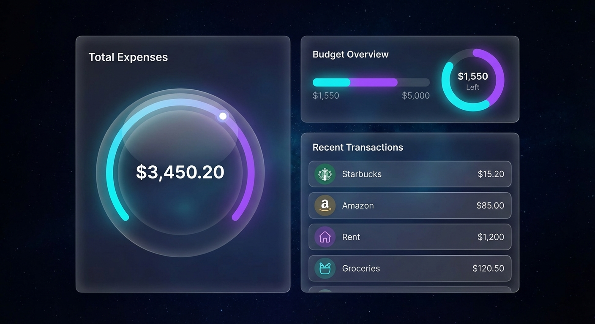

# Expense Tracker V2

A premium, modern expense tracking application built with Django. Features a glassmorphism design, interactive charts, and comprehensive budget management.

## 🚀 Live Demo




### Deploy your own:

[](https://render.com/deploy?repo=https://github.com/Aravind74186/Expenses-tracker-)
[](https://railway.app/new)

## ✨ Features

- **Premium UI/UX**: Modern glassmorphism design with a dark mode aesthetic.
- **Dashboard**: Real-time overview of your expenses and budget status.
- **Expense Tracking**: Easily add, edit, and categorize expenses.
- **Budget Management**: Set monthly budgets and track your progress.
- **Visual Analytics**: Interactive charts to visualize spending trends.
- **Responsive Design**: Works seamlessly on desktop and mobile devices.

## 🛠️ Tech Stack

- **Backend**: Django (Python)
- **Frontend**: HTML5, CSS3 (Custom Glassmorphism), JavaScript
- **Database**: SQLite (Development)
- **Fonts**: Google Fonts (Outfit)

## 📦 Installation

1. **Clone the repository**
   ```bash
   git clone https://github.com/Aravind74186/Expenses-tracker-.git
   cd Expenses-tracker-
   ```

2. **Create a virtual environment**
   ```bash
   python -m venv .venv
   source .venv/bin/activate  # On Windows: .venv\Scripts\activate
   ```

3. **Install dependencies**
   ```bash
   pip install -r requirements.txt
   ```

4. **Run migrations**
   ```bash
   python manage.py migrate
   ```

5. **Start the development server**
   ```bash
   python manage.py runserver
   ```

6. **Visit the app**
   Open [http://127.0.0.1:8000](http://127.0.0.1:8000) in your browser.

## 🤝 Contributing

Contributions are welcome! Please read our [Contributing Guide](CONTRIBUTING.md) for details.

## 📄 License

This project is licensed under the MIT License.
